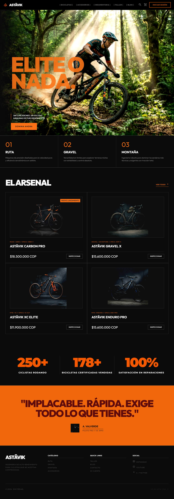
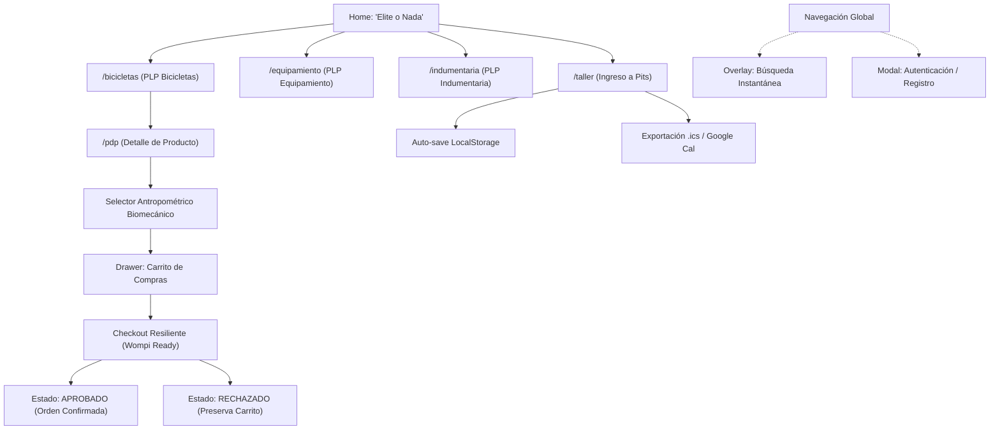

# Astāvik Performance Lab — High-Performance Cycling & Engineering Lab

[](PRD_Astavik_Performance_Lab_MVP.md)
[](PRD_Astavik_Performance_Lab_MVP.md)
[](package.json)
[](tests/biomechanics.test.js)
[](assets/css/style.css)
[](decisions/decisiones.md)
[](DESIGN.md)

> *"ELITE O NADA. Sin concesiones. Sin excusas. Máquinas de alto rendimiento."*

Plataforma web insignia e-commerce D2C de alta gama y centro de agendamiento técnico de taller especializado (**"Ingreso a Pits"**) para bicicletas de alto módulo de carbono y aleaciones aeroespaciales, indumentaria técnica y telemetría de precisión en Colombia.

---

## 📸 Vista General de la Plataforma



---

## 📑 Tabla de Contenidos

1. [Visión y Propósito](#-visión-y-propósito)
2. [Características Principales](#-características-principales)
3. [Arquitectura de Información & Guía Visual](#-arquitectura-de-información--guía-visual)
4. [Pipeline de Build, Desarrollo & Testing](#-pipeline-de-build-desarrollo--testing)
5. [Stack Tecnológico](#-stack-tecnológico)
6. [Sistema de Diseño & Design Tokens](#-sistema-de-diseño--design-tokens)
7. [Estructura del Proyecto](#-estructura-del-proyecto)
8. [Inicio Rápido & Comandos NPM](#-inicio-rápido--comandos-npm)
9. [Cumplimiento Heurístico & Accesibilidad (WCAG AA)](#-cumplimiento-heurístico--accesibilidad-wcag-aa)
10. [Convenciones Técnicas y Reglas Invariantes](#-convenciones-técnicas-y-reglas-invariantes)
11. [Estado del Proyecto y Hoja de Ruta](#-estado-del-proyecto-y-hoja-de-ruta)
12. [Licencia y Créditos](#-licencia-y-créditos)

---

## 🏁 Visión y Propósito

**Astāvik Performance Lab** materializa la filosofía **"Velocity and Precision"**:
- **D2C de Máximo Rendimiento:** Catálogo de 24 productos y servicios de alta competición con precios y transacciones nativas en pesos colombianos (`$ COP`).
- **Laboratorio de Precisión ("Ingreso a Pits"):** Automatización del agendamiento de mantenimiento técnico para bicicletas de alta gama en Bogotá, con autoguardado en almacenamiento local y sincronización de calendario (.ics y Google Calendar).
- **Selector Antropométrico Biomecánico:** Recomendador dinámico basado en la relación entrepierna/estatura del ciclista para determinar postura de cuadro (*Endurance* vs. *Aero/Agresiva*).
- **Estética Void Black:** Identidad visual brutalista, tipografía masiva editorial, grillas técnicas de alto contraste y tiempos de respuesta instantáneos.
- **Rendimiento Web Extremo:** Arquitectura local compilada con Tailwind CLI (hoja de estilos purgada de tan solo 34KB), eliminando FOUC (*Flash of Unstyled Content*) y optimizando el Core Web Vital LCP $\le 1.8\text{ s}$.

---

## 🚀 Características Principales

### 🚴 1. Catálogo Técnico y PDP Avanzado
- **Segmentación por Disciplina:**
  - `01 RUTA:` Máquinas aerodinámicas de transferencia de potencia pura (*Astāvik Carbon Pro* — `$18.500.000 COP`, *Astāvik Aeter Chrono Carbon* — `$22.480.000 COP`).
  - `02 GRAVEL:` Geometría de absorción torsional y versatilidad mixta (*Astāvik Gravel X* — `$15.600.000 COP`).
  - `03 MONTAÑA:` Cuadros de doble suspensión y rígidos de competición (*Astāvik XC Elite* — `$11.900.000 COP`, *Astāvik Enduro Pro* — `$15.600.000 COP`).
- **Equipamiento de Precisión:** 6 categorías técnicas (Electrónica, Componentes, Taller, Transporte, Hidratación, Equipamiento Personal).
- **Indumentaria Técnica:** 9 prendas de alta transpirabilidad y compresión biomecánica con selector de tallas táctil ($\ge 44\text{ px}$).
- **Calculador Biomecánico en PDP:** Cálculo en vivo del ratio entrepierna/estatura ($\text{entrepierna}/\text{estatura}$). Proporciona diagnóstico de postura recomendado y permite anulación manual de talla por el usuario.

### ⏱️ 2. Módulo de Taller: "Ingreso a Pits"
- **3 Protocolos de Intervención:**
  - *Calibración Exprés (Aero & Drivetrain)* — `$90.000 COP`
  - *Mantenimiento Pro (Suspensión & Rodamientos)* — `$180.000 COP`
  - *Overhaul Completo (Desarme, Ultrasonido & Telemetría)* — `$250.000 COP`
- **Gestión de Cupos en Tiempo Real:** Horario oficial (`Lun-Vie: 08:00 - 18:00 | Sáb: 08:00 - 14:00`), validación estricta que bloquea fechas pasadas y domingos.
- **Resiliencia & Persistencia:** Almacenamiento reactivo en `localStorage` que recupera el progreso del formulario tras desconexiones o recargas accidentales.
- **Exportación de Citas:** Generación instantánea de evento descargable `.ics` (RFC 5545) y enlace dinámico a Google Calendar.

### ⚡ 3. Búsqueda Instantánea & Navegación SPA
- **Búsqueda Reactiva en Cliente:** Búsqueda difusa en el índice completo de bicicletas, equipamiento, indumentaria y servicios técnicos.
- **Search Overlay Táctico:** Búsqueda asistida por teclado (flechas `↑` `↓`, `Enter`, `Escape`), consultas sugeridas (*trending*) y accesos directos por disciplina.
- **Enrutamiento SPA & Historial:** Sincronización con `history.pushState` y evento `popstate` para compatibilidad completa con el botón atrás/adelante del navegador (`#bicicletas`, `#equipamiento`, `#indumentaria`, `#taller`, `#pdp`).

### 🛡️ 4. Checkout Resiliente y Wompi Ready
- **Carrito Persistente:** Modificación dinámica de cantidades, cálculo de flete y liquidación de impuestos en COP sin recarga de página.
- **Guest Checkout:** Cero barreras forzosas de registro para completar pedidos.
- **Gestión de Estados de Transacción:** Diálogos modales personalizados con feedback inmediato (`APPROVED`, `DECLINED`, `ERROR`), garantizando que el carrito nunca se vacíe prematuramente ante un error de pago.

---

## 📐 Arquitectura de Información & Guía Visual

### Flujo de la Aplicación (Mermaid)


### 🗺️ Guía Visual Interactiva (`mapa_visual_astavik.html`)
El proyecto incluye [`mapa_visual_astavik.html`](mapa_visual_astavik.html), una herramienta interactiva 100% nativa (sin dependencias externas) que despliega:
- Arquitectura de páginas y vistas modales.
- Mapa de componentes atómicos y estados interactivos.
- Relaciones de eventos de navegación SPA y persistencia en cliente.
- Diagnóstico visual de tokens y armonía cromática Void Black.

---

## 🧪 Pipeline de Build, Desarrollo & Testing

El proyecto integra un pipeline de desarrollo profesional con **Vite**, compilador **Tailwind CSS CLI v3** y suite de pruebas unitarias automatizadas con **Vitest**:

### Compilación CSS Optimizada
Los estilos se procesan desde `src/input.css` hacia `assets/css/style.css` mediante `@tailwindcss/forms` y `@tailwindcss/container-queries`:
- **Tamaño:** 34 KB minificado (6.95 KB gzip).
- **Cero FOUC:** Los estilos críticos cargan instantáneamente sin esperar scripts CDN externos.
- **Fallback Activo:** `code.html` mantiene el CDN como red de seguridad en modo offline estático.

### Suite de Pruebas Biomecánicas (`tests/biomechanics.test.js`)
Pruebas automatizadas ejecutadas con **Vitest** que certifican la integridad del cálculo antropométrico:
- `calculateBiomechanics(height, inseam)`:
  - Asignación de tallas: `XS` (<165cm), `S` (165-171cm), `M` (172-181cm), `L` (182-189cm) y `XL` ($\ge$190cm).
  - Cálculo del ratio $\text{entrepierna}/\text{estatura}$.
  - Diagnóstico postural: `Endurance` si ratio $> 0.48$, `Aero` si ratio $\le 0.48$.
- **Resultado:** 100% aprobado (5/5 tests pasados en $\sim 250\text{ ms}$).

---

## 💻 Stack Tecnológico

| Componente | Tecnología | Versión | Propósito |
| :--- | :--- | :--- | :--- |
| **Bundler & Dev Server** | Vite | `^8.3.0` | Servidor HMR en puerto `5173`, rewrite automático a `/code.html` y empaquetado de producción. |
| **Compilador CSS** | Tailwind CSS CLI | `^3.4.19` | Compilación y purga local de clases hacia `assets/css/style.css` (34KB). |
| **Post-procesamiento** | PostCSS + Autoprefixer | `^8.5.28` / `^10.6.1` | Compatibilidad cross-browser y prefijos automáticos para CSS moderno. |
| **Plugins Tailwind** | Forms & Container Queries | `^0.5.11` / `^0.1.1` | Reset técnico de controles de formulario y contenedores adaptativos. |
| **Framework de Tests** | Vitest | `^5.0.1` | Ejecución ultrarrápida de pruebas unitarias para algoritmos biomecánicos. |
| **Estructura** | HTML5 Semántico | Estándar W3C | Landmark regions (`header`, `main`, `section`, `footer`), roles ARIA y accesibilidad. |
| **Lógica & Estado** | Vanilla JavaScript (ES6+) | Estándar ECMAScript | Enrutador SPA hash-based, carrito reactivo y sincronización de `localStorage`. |
| **Tipografía** | Google Fonts | Webfonts CDN | **Montserrat** (Display 900 / Titulares técnicos) & **Inter** (Cuerpo de texto y métricas). |
| **Iconografía** | Material Symbols & Lucide | Webfonts / `^1.47.0` | Iconos técnicos vectoriales optimizados. |
| **Calendario** | Blob API / RFC 5545 | Nativo Browser | Creación y descarga cliente de archivos `.ics` e interoperabilidad con Google Calendar. |

---

## 🎨 Sistema de Diseño & Design Tokens

El sistema de diseño implementa una estética editorial de precisión militar denominada **Void Black**:

### Paleta Primaria
| Token | Valor Hex | Muestra | Uso |
| :--- | :--- | :--- | :--- |
| `void-black` | `#0A0A0A` | `■` | Fondo global y contenedores base. |
| `surface-dim` | `#141313` | `■` | Superficie de cards secundarias. |
| `surface-low` | `#1A1A1A` | `■` | Fondo de elementos interactivos y drawers. |
| `surface-mid` | `#262626` | `■` | Bordes técnicos y separadores de grilla. |
| `surface-high` | `#404040` | `■` | Estados de hover y bordes activos. |
| `brand-orange` | `#FF4D00` | `■` | Acento de alta visibilidad, badges y CTAs primarios. |
| `brand-magenta`| `#E91E63` | `■` | Detalles de telemetría y acentos de competición. |

### Reglas Tipográficas
- **Titulares & Números de Ingeniería:** `font-family: 'Montserrat', sans-serif;` con tracking negativo (`letter-spacing: -0.04em`) y peso `800`/`900`.
- **Cuerpo, UI & Especificaciones:** `font-family: 'Inter', sans-serif;` con pesos `400`/`500`/`600` para máxima legibilidad sobre fondo oscuro.

---

## 📁 Estructura del Proyecto

```
astavik/
├── .gitignore                         # Reglas de exclusión de git (node_modules, dist, logs)
├── package.json                       # Manifiesto de scripts y dependencias (Vite, Tailwind, Vitest)
├── package-lock.json                  # Árbol de dependencias bloqueado
├── postcss.config.js                  # Configuración de PostCSS con Tailwind y Autoprefixer
├── tailwind.config.js                 # Tokens de diseño, colores Void Black y tipografías
├── vite.config.js                     # Configuración del servidor de desarrollo Vite y rewrites
├── AGENTS.md                          # Protocolo y memoria central para agentes de IA
├── DESIGN.md                          # Tokens de diseño y especificaciones visuales
├── PRD_Astavik_Performance_Lab_MVP.md # Documento de requisitos de producto (PRD oficial)
├── README.md                          # Documentación técnica principal del proyecto
├── code.html                          # Aplicación Web SPA monolítica de alto rendimiento
├── mapa_visual_astavik.html           # Guía visual interactiva de arquitectura y componentes
├── screen.png                         # Captura de pantalla de referencia del prototipo
├── reglas.md                          # Reglas invariantes del sistema y líneas rojas
│
├── src/
│   └── input.css                      # Punto de entrada CSS con directivas Tailwind y tokens
│
├── assets/
│   ├── css/
│   │   └── style.css                  # Hoja de estilos minificada compilada (34KB)
│   └── images/                        # Assets estructurados por módulo (24 productos + UI)
│       ├── apparel/                   # Indumentaria técnica
│       ├── athletes/                  # Social proof y atletas
│       ├── auth/                      # Gráficos del modal de login
│       ├── bikes/                     # Catálogo de bicicletas de alto rendimiento
│       ├── brand/                     # Isotipo, logotipo y manual de marca
│       ├── equipment/                 # Equipamiento y sensores de telemetría
│       ├── hero/                      # Fotografías a sangre del hero
│       ├── pdp/                       # Vistas de producto y geometrías
│       ├── search/                    # Cards visuales del search overlay
│       └── taller/                    # Protocolos e instalaciones del taller
│
├── tests/
│   └── biomechanics.test.js           # Suite de pruebas unitarias Vitest para antropometría
│
├── decisions/
│   ├── decisiones.md                  # Bitácora de decisiones arquitectónicas (ADR)
│   └── design.md                      # Decisiones de diseño y alineación de tokens
│
├── gotchas/
│   └── problemas-conocidos.md         # Errores recurrentes y soluciones validadas
│
├── logs/
│   └── sesiones-resumen.md            # Registro condensado de sesiones de trabajo
│
├── skills/
│   └── actualizar-contexto.md         # Skill de sincronización y cierre de memoria
│
└── state/
    └── estado-actual.md               # Tablero de control de avance (Done / To-Do)
```

---

## ⚡ Inicio Rápido & Comandos NPM

### 1. Flujo Estándar con NPM (Recomendado)
Asegúrate de contar con Node.js ($\ge 18$) instalado:

```bash
# 1. Instalar dependencias
npm install

# 2. Iniciar servidor de desarrollo en caliente (Vite en http://localhost:5173)
npm run dev

# 3. Compilar CSS de producción optimizado (genera assets/css/style.css)
npm run build:css

# 4. Ejecutar la suite de pruebas unitarias (Vitest)
npm test

# 5. Generar build de producción
npm run build

# 6. Previsualizar build de producción
npm run preview
```

### 2. Flujo Alternativo Estático (Zero-Build)
Si prefieres inspeccionar el código de manera directa sin compilar:

- **Python HTTP Server:** `python -m http.server 8000` $\rightarrow$ Abrir `http://localhost:8000/code.html`
- **Extensión Live Server (VS Code):** Clic derecho en `code.html` $\rightarrow$ *"Open with Live Server"*.
- **Guía Visual:** Abrir directamente `mapa_visual_astavik.html` en cualquier navegador.

---

## ♿ Cumplimiento Heurístico & Accesibilidad (WCAG AA)

La aplicación ha sido auditada y remediada bajo los estándares de las **10 Heurísticas de Usabilidad de Nielsen** y lineamientos **WCAG 2.1 Nivel AA**:

- **H1: Visibilidad del estado del sistema:** Indicadores de paso claros en checkout, toasts interactivos y confirmación visual inmediata al añadir al carrito.
- **H2: Correspondencia con el mundo real:** Selector de tallas con terminología biomecánica real ($\text{entrepierna}/\text{estatura}$ y ángulos posturales).
- **H3: Control y libertad del usuario:** Cierre de modales con tecla `Esc`, botón atrás del navegador sincronizado con el historial SPA y anulación manual de tallas.
- **H4: Consistencia y estándares:** Aplicación rigurosa de design tokens e iconografía técnica unificada.
- **H5: Prevención de errores:** Bloqueo de fechas pasadas y domingos en el taller, validación de formatos de contacto antes de enviar.
- **H6: Reconocimiento antes que recuerdo:** Resumen en vivo del pedido en el drawer, autocompletado en búsqueda táctica y persistencia en cliente.
- **H7: Flexibilidad y eficiencia de uso:** Navegación por teclado en el buscador, accesos directos por disciplina y agendamiento exprés de Pits.
- **H8: Diseño estético y minimalista:** Eliminación de ruido visual; contraste Void Black de alta densidad informativa sin saturación.
- **H9: Ayuda a diagnosticar y recuperarse de errores:** Mensajes contextuales descriptivos con sugerencias de acción; erradicación total de bloqueantes `alert()`.
- **H10: Ayuda y documentación:** Asistencia directa mediante widget técnico flotante de WhatsApp y microcopys informativos en cada selector.
- **Touch Targets:** Todos los botones, chips de talla e interactivos cumplen la norma mínima de área táctil ($\ge 44 \times 44\text{ px}$).

---

## ⚖️ Convenciones Técnicas y Reglas Invariantes

Para preservar la integridad del sistema, cualquier contribución o modificación debe seguir estrictamente estas reglas:

1. **Formato Monetario Estricto:** Todos los precios deben expresarse en formato oficial de moneda local con separador de miles y sufijo de divisa: `$XX.XXX.XXX COP` (Ejemplo: `$18.500.000 COP`, `$90.000 COP`).
2. **Invarianza de Paleta y Tipografía:** Prohibido sustituir el fondo `#0A0A0A` o los acentos `#FF4D00` por esquemas claros o genéricos sin consenso previo documentado en `decisions/`.
3. **Resiliencia de Flujos:** Nunca interrumpir el hilo de ejecución con diálogos nativos (`alert()`, `confirm()`, `prompt()`); emplear siempre los modales accesibles integrados en el diseño.
4. **Integridad de Pruebas:** Cualquier modificación en la lógica biomecánica debe estar acompañada por la correspondiente actualización y aprobación en `tests/biomechanics.test.js` (`npm test`).
5. **Memoria de Agentes:** Toda decisión arquitectónica, problema resuelto o avance debe sincronizarse en las carpetas `decisions/`, `gotchas/` y `state/` conforme a [AGENTS.md](AGENTS.md).

---

## 🗺️ Estado del Proyecto y Hoja de Ruta

- [x] **Fase 1: Tokens Globales y Layout Base** (Header con glassmorphism, footer técnico, navegación).
- [x] **Fase 2: Catálogo Completo & Selector Biomecánico** (24 productos, cálculo antropométrico, checkout resiliente).
- [x] **Fase 2.5: Auditoría y Remediación Heurística** (Historial de navegación, modales sin alert, horario de taller estricto).
- [x] **Pipeline de Build & Testing Automatizado** (Vite 8, Tailwind CLI local con purga de 34KB, PostCSS, blindaje `.gitignore` y 5/5 tests aprobados en Vitest).
- [x] **Guía Visual y Arquitectura Interactiva** ([`mapa_visual_astavik.html`](mapa_visual_astavik.html) 100% operativo).
- [ ] **Fase 3: Optimización de Assets Locales** (Migración de URLs remotas a imágenes locales optimizadas en `assets/images/` con ratios anti-CLS).
- [ ] **Fase 4: Integración API Wompi de Producción** (Webhooks de backend, firmas de integridad y tokenización).
- [ ] **Fase 5: Telemetría & Perfil de Atleta** (Historial de calibración de suspensiones y registro de telemetría de ruta).

---

## 📄 Licencia y Créditos

Desarrollado con máxima exigencia técnica para **Astāvik Performance Lab** (Bogotá, Colombia).  
Todos los derechos reservados © 2026. Prohibida su reproducción sin autorización de ingeniería de Astāvik.
